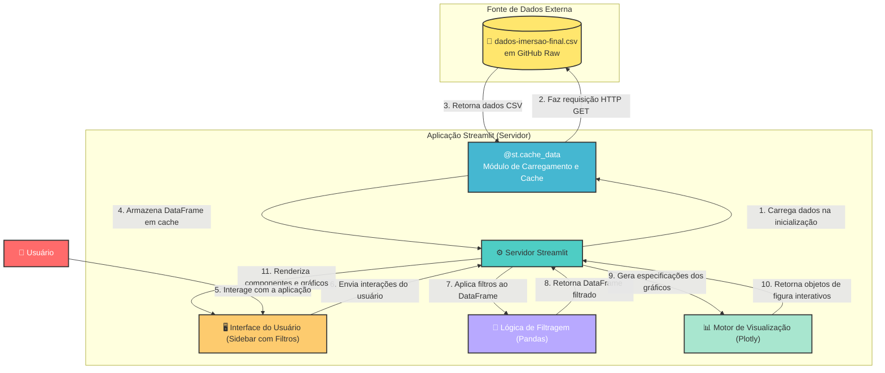

# Dashboard Interativo para Análise de Salários em Carreiras de Dados
*Visualizando Tendências e Oportunidades no Mercado Global de Dados.*

---

## Abstract (Resumo Técnico)
Este projeto apresenta um dashboard interativo de análise de salários, desenvolvido como uma aplicação web utilizando o framework Streamlit em Python. O sistema aborda a necessidade crítica de profissionais da área de dados por informações salariais transparentes e granulares, que são frequentemente dispersas, estáticas ou inacessíveis. A solução proposta consiste em uma plataforma centralizada que permite a exploração dinâmica de um conjunto de dados salariais globais. A metodologia emprega a biblioteca Pandas para a manipulação e filtragem eficiente dos dados e a biblioteca Plotly para a geração de um conjunto diversificado de visualizações interativas, incluindo gráficos de barras, histogramas, mapas coropléticos, boxplots, treemaps, entre outros. O resultado é uma ferramenta poderosa que capacita os usuários a segmentar os dados por múltiplos critérios — como senioridade, ano, tipo de contrato e tamanho da empresa — para extrair insights acionáveis sobre benchmarks salariais, distribuições e correlações geográficas. A principal contribuição do projeto, originado na Imersão Python da Alura, é a democratização do acesso a inteligência de mercado de carreiras, fornecendo um recurso de código aberto para planejamento de carreira e pesquisa de mercado na indústria de dados.

## Badges Abrangentes


## Sumário (Table of Contents)
1.  [Introdução e Motivação](#introdução-e-motivação)
2.  [Arquitetura do Sistema](#arquitetura-do-sistema)
3.  [Decisões de Design Chave](#decisões-de-design-chave)
4.  [✨ Funcionalidades Detalhadas](#-funcionalidades-detalhadas-com-casos-de-uso)
5.  [🛠️ Tech Stack Detalhado](#️-tech-stack-detalhado)
6.  [📂 Estrutura Detalhada do Código-Fonte](#-estrutura-detalhada-do-código-fonte)
7.  [📋 Pré-requisitos Avançados](#-pré-requisitos-avançados)
8.  [🚀 Guia de Instalação e Configuração Avançada](#-guia-de-instalação-e-configuração-avançada)
9.  [⚙️ Uso Avançado e Exemplos](#️-uso-avançado-e-exemplos)
10. [🔧 API Reference](#-api-reference-se-aplicável)
11. [🧪 Estratégia de Testes e Qualidade de Código](#-estratégia-de-testes-e-qualidade-de-código)
12. [🚢 Deployment Detalhado e Escalabilidade](#-deployment-detalhado-e-escalabilidade)
13. [📜 Licença e Aspectos Legais](#-licença-e-aspectos-legais)
14. [📚 Publicações, Artigos e Citações](#-publicações-artigos-e-citações-se-aplicável)
15. [👥 Equipe Principal e Colaboradores Chave](#-equipe-principal-e-colaboradores-chave)
16. [❓ FAQ (Perguntas Frequentes)](#-faq-perguntas-frequentes)
17. [📞 Contato e Suporte](#-contato-e-suporte)

## Introdução e Motivação
A área de dados está em constante expansão, tornando as decisões de carreira cada vez mais complexas. Profissionais, desde iniciantes até especialistas, necessitam de informações precisas e contextualizadas para negociar salários, planejar transições de carreira e entender o panorama do mercado global. No entanto, os dados salariais são frequentemente apresentados em relatórios estáticos, agregados de forma genérica ou ocultos por paywalls, limitando a capacidade de uma análise aprofundada e personalizada.

Este projeto, concebido no âmbito da **Imersão Python da Alura**, nasceu da motivação de superar essas barreiras. O objetivo central é fornecer uma ferramenta de código aberto, interativa e visualmente rica que capacite a comunidade de dados a explorar livremente as tendências salariais. A proposta de valor reside na transformação de um conjunto de dados brutos em um dashboard dinâmico, onde o usuário detém o controle para filtrar, segmentar e visualizar as informações de acordo com suas próprias indagações. Ao invés de consumir conclusões pré-definidas, o usuário é convidado a conduzir sua própria investigação, comparando o impacto da senioridade, do modelo de contrato, do tamanho da empresa e da localização geográfica na remuneração.

O diferencial deste projeto é a sua abordagem prática e focada no usuário final, utilizando um stack tecnológico moderno e eficiente (Streamlit, Pandas, Plotly) para entregar uma experiência de análise de dados fluida e intuitiva, diretamente no navegador.

## Arquitetura do Sistema
A arquitetura do projeto é centrada na simplicidade e eficiência, característica das aplicações desenvolvidas com Streamlit. Trata-se de uma arquitetura monolítica, contida em um único script Python (`app.py`), que gerencia todo o ciclo de vida da aplicação, desde a interação do usuário até a renderização dos dados.

O fluxo de dados e controle pode ser representado pelo seguinte diagrama:



**Componentes Principais:**
1.  **Usuário (User):** Interage com a aplicação através do navegador, selecionando opções nos filtros da barra lateral.
2.  **Interface do Usuário (Streamlit Frontend):** Renderiza todos os widgets (filtros, métricas, abas) e gráficos. A barra lateral (`st.sidebar`) é o principal ponto de entrada para a interação do usuário.
3.  **Módulo de Carregamento e Cache (`@st.cache_data`):** Responsável por carregar o dataset a partir de uma URL remota. O uso do decorador `@st.cache_data` é uma decisão arquitetural crucial para a performance, pois garante que o download e o parsing do CSV ocorram apenas uma vez, com o DataFrame resultante sendo mantido em memória para todas as sessões e interações subsequentes.
4.  **Lógica de Filtragem (Pandas):** Após uma interação do usuário, esta camada aplica as seleções dos filtros ao DataFrame principal do Pandas, criando um subconjunto de dados dinâmico para análise.
5.  **Motor de Visualização (Plotly):** Utiliza o DataFrame filtrado para gerar os objetos de figura interativos. Cada gráfico (barras, pizza, mapa, etc.) é uma instância de um objeto Plotly.
6.  **Fonte de Dados (GitHub Raw):** O projeto desacopla os dados da aplicação, consumindo um arquivo CSV hospedado remotamente. Isso facilita a atualização do dataset sem a necessidade de modificar o código da aplicação.

## Decisões de Design Chave
As escolhas tecnológicas e de design foram orientadas pela necessidade de desenvolvimento rápido, interatividade e manutenibilidade para um projeto de escopo focado.

*   **Linguagem: Python**
    *   **Justificativa:** A escolha natural para análise de dados, devido ao seu ecossistema maduro e robusto, incluindo bibliotecas como Pandas e Plotly. A sintaxe clara facilita a implementação da lógica de negócio.

*   **Framework Web: Streamlit**
    *   **Justificativa:** Streamlit foi selecionado por sua capacidade de transformar scripts de dados em aplicações web interativas com um mínimo de código boilerplate. Sua API imperativa permite que desenvolvedores foquem na lógica de dados, enquanto o framework gerencia o estado da UI, o fluxo de re-renderização e a interação com widgets.
    *   **Alternativas Consideradas:** Dash (mais verboso e complexo para prototipagem rápida) e Flask/Django com uma biblioteca de gráficos JS (maior curva de aprendizado e separação entre backend e frontend). Streamlit ofereceu o melhor trade-off entre velocidade de desenvolvimento e funcionalidade para este caso de uso.

*   **Manipulação de Dados: Pandas**
    *   **Justificativa:** É o padrão da indústria para manipulação de dados em Python. Sua estrutura de DataFrame é ideal para armazenar, filtrar, agregar e transformar os dados tabulares do projeto. A performance para operações vetoriais é excelente para o tamanho do dataset utilizado.

*   **Visualização de Dados: Plotly**
    *   **Justificativa:** Plotly foi escolhido por sua capacidade de gerar gráficos interativos e esteticamente agradáveis que são nativamente compatíveis com Streamlit. A interatividade (tooltips, zoom, pan) enriquece a experiência do usuário, permitindo uma exploração mais profunda dos dados. A vasta gama de tipos de gráficos disponíveis (mapas, treemaps, sunbursts) permitiu a implementação de todas as funcionalidades de visualização desejadas.

*   **Gerenciamento de Performance: `st.cache_data`**
    *   **Justificativa:** O carregamento de dados de uma fonte remota é uma operação de I/O custosa. A utilização do mecanismo de cache do Streamlit é uma decisão crítica para garantir que a aplicação permaneça responsiva após o carregamento inicial. Ele evita a repetição de downloads e processamento de dados a cada interação do usuário nos filtros.

## ✨ Funcionalidades Detalhadas (com Casos de Uso)

O dashboard oferece um conjunto rico de funcionalidades para uma análise completa dos dados salariais.

1.  **Filtragem Multidimensional Dinâmica**
    *   **Descrição:** A barra lateral permite que os usuários filtrem o conjunto de dados simultaneamente por quatro dimensões: Ano, Senioridade, Tipo de Contrato e Tamanho da Empresa. Todas as métricas e gráficos na página principal são atualizados instantaneamente para refletir a seleção.
    *   **Caso de Uso:** Um desenvolvedor Pleno quer investigar o mercado em 2024 para empresas de médio porte que contratam como PJ. Ele seleciona `2024` no filtro "Ano", `Pleno` em "Senioridade", `Médio` em "Tamanho da empresa" e `PJ` em "Tipo de contrato" para ver todos os dados relevantes para seu perfil.

2.  **Métricas Gerais (KPIs)**
    *   **Descrição:** Quatro cartões no topo da página fornecem um resumo estatístico dos dados filtrados: Salário Médio Anual (USD), Salário Máximo Anual (USD), Total de Registros correspondentes e o Cargo Mais Frequente.
    *   **Caso de Uso:** Após aplicar os filtros, o usuário do exemplo anterior pode ver imediatamente o salário médio para sua pesquisa, o maior salário registrado nesse nicho e quantos pontos de dados suportam essa análise.

3.  **Top 10 Cargos por Salário Médio**
    *   **Descrição:** Um gráfico de barras horizontais que exibe os 10 cargos com a maior média salarial anual (USD) com base nos filtros aplicados.
    *   **Caso de Uso:** Uma empresa de recrutamento quer identificar os cargos mais valorizados no setor de dados para focar suas estratégias de aquisição de talentos.

4.  **Distribuição de Salários Anuais**
    *   **Descrição:** Um histograma que mostra a frequência de salários em diferentes faixas de valores, permitindo visualizar a concentração e a dispersão da remuneração.
    *   **Caso de Uso:** Um estudante de ciência de dados pode analisar a distribuição para entender se os salários para a posição de "Júnior" estão concentrados em uma faixa específica ou se há uma grande variabilidade.

5.  **Proporção dos Tipos de Trabalho**
    *   **Descrição:** Um gráfico de pizza (donut chart) que ilustra a proporção de vagas totalmente remotas, híbridas ou presenciais.
    *   **Caso de Uso:** Um profissional que busca exclusivamente trabalho remoto pode filtrar por senioridade e país para ver qual a prevalência dessa modalidade no seu mercado-alvo.

6.  **Salário Médio de Cientista de Dados por País**
    *   **Descrição:** Um mapa coroplético mundial que colore os países com base no salário médio anual (USD) especificamente para o cargo de "Data Scientist".
    *   **Caso de Uso:** Um Cientista de Dados avaliando oportunidades internacionais pode usar este mapa para identificar rapidamente os países com as maiores médias salariais para sua profissão.

7.  **Abas de Análise Avançada**
    *   **Descrição:** Uma seção com abas que oferece modelos de visualização mais complexos para análises aprofundadas:
        *   **Boxplot por Cargo:** Compara a distribuição (mediana, quartis, outliers) dos salários entre os top 10 cargos.
        *   **Violino por Senioridade:** Mostra a densidade da distribuição salarial para cada nível de senioridade.
        *   **Treemap País → Cargo:** Visualiza a hierarquia de salários médios, agrupando cargos dentro de países.
        *   **Sunburst Senioridade → Contrato:** Analisa a distribuição de tipos de contrato dentro de cada nível de senioridade.
        *   **Heatmap Senioridade × Contrato:** Um mapa de calor que mostra a média salarial na interseção de cada senioridade e tipo de contrato.
        *   **Linha por Cargo ao Longo do Tempo:** Traça a evolução salarial dos 5 principais cargos ao longo dos anos.
        *   **Mapa Animado por Ano:** Um mapa coroplético animado que mostra a evolução do salário médio de um cargo selecionável através dos anos.
    *   **Caso de Uso:** Um analista de RH pode usar o Heatmap para entender qual combinação de senioridade e contrato (ex: Sênior/PJ vs. Sênior/CLT) tem a maior média salarial, auxiliando na definição de pacotes de remuneração competitivos.

## 🛠️ Tech Stack Detalhado

| Categoria | Tecnologia | Propósito no Projeto | Justificativa da Escolha |
| :--- | :--- | :--- | :--- |
| **Linguagem** | Python 3.x | Linguagem principal para toda a lógica da aplicação. | Ecossistema maduro para ciência de dados, sintaxe clara e ampla adoção na comunidade. |
| **Framework Web** | Streamlit | Construção da interface do usuário, gerenciamento de estado e servidor web. | Permite a criação de aplicações de dados interativas com código Python puro, acelerando drasticamente o desenvolvimento. |
| **Manipulação de Dados** | Pandas | Carregamento, limpeza, filtragem e agregação do conjunto de dados salariais. | Padrão de fato para manipulação de dados em Python, oferecendo estruturas de dados (DataFrame) e operações de alta performance. |
| **Visualização de Dados** | Plotly | Geração de todos os gráficos interativos (barras, mapas, histogramas, etc.). | Oferece uma vasta gama de gráficos, alta qualidade visual e interatividade nativa, com excelente integração ao Streamlit. |
| **Componentes de UI** | streamlit-elements | (Inferido) Usado para criar layouts e componentes de UI mais complexos. | Expande as capacidades nativas do Streamlit para designs de dashboard mais sofisticados. |
| **Componentes de UI** | streamlit-option-menu | (Inferido) Usado para criar menus de navegação, como a barra lateral ou abas. | Fornece uma alternativa visualmente mais atraente aos widgets de seleção padrão do Streamlit. |

## 📂 Estrutura Detalhada do Código-Fonte
A estrutura do projeto é minimalista e focada, refletindo uma aplicação contida em um único script principal, o que é comum e eficiente para projetos com Streamlit de escopo definido.

```
imersao-python-alura-agosto-2025-final-main/
├── app.py                  # Script principal da aplicação Streamlit. Contém toda a lógica de UI,
│                           # processamento de dados e geração de gráficos.
├── dados-imersao-final.csv # O conjunto de dados brutos utilizado pela aplicação (neste caso,
│                           # o app carrega de uma URL, mas o arquivo está no repo).
├── requirements.txt        # Arquivo que lista todas as dependências Python do projeto. Essencial
│                           # para a reprodutibilidade do ambiente.
└── README.md               # Este arquivo de documentação.
```

*   **`app.py`**: É o coração do projeto. O código é organizado em seções lógicas usando comentários (`# =========================`), separando a configuração da página, o carregamento de dados, a lógica da barra lateral (filtros), o processamento do DataFrame, e a renderização de cada componente visual (KPIs e gráficos).
*   **`requirements.txt`**: Define o ambiente de software necessário. Qualquer pessoa que clone o repositório pode recriar o ambiente exato usando `pip install -r requirements.txt`.

## 📋 Pré-requisitos Avançados
Para executar este projeto localmente, os seguintes componentes são necessários:

*   **Python:** Versão 3.8 ou superior.
*   **pip:** Gerenciador de pacotes do Python (geralmente instalado com o Python).
*   **Git:** Sistema de controle de versão para clonar o repositório.
*   **Ambiente Virtual (Recomendado):** Ferramentas como `venv` ou `conda` são fortemente recomendadas para isolar as dependências do projeto e evitar conflitos com outros pacotes Python no sistema.

## 🚀 Guia de Instalação e Configuração Avançada
Siga os passos abaixo para configurar e executar o dashboard em seu ambiente de desenvolvimento local.

1.  **Clonar o Repositório:**
    Abra um terminal e clone o repositório do GitHub.
    ```bash
    git clone https://github.com/ESousa97/imersao-python-alura-agosto-2025-final.git
    ```

2.  **Navegar para o Diretório do Projeto:**
    ```bash
    cd imersao-python-alura-agosto-2025-final
    ```

3.  **Criar e Ativar um Ambiente Virtual (Recomendado):**
    *   **No macOS/Linux:**
        ```bash
        python3 -m venv venv
        source venv/bin/activate
        ```
    *   **No Windows:**
        ```bash
        python -m venv venv
        .\venv\Scripts\activate
        ```

4.  **Instalar as Dependências:**
    Com o ambiente virtual ativado, instale todas as bibliotecas necessárias listadas no arquivo `requirements.txt`.
    ```bash
    pip install -r requirements.txt
    ```

5.  **Executar a Aplicação Streamlit:**
    Inicie o servidor do Streamlit. Ele abrirá automaticamente uma nova aba no seu navegador padrão com o dashboard em execução.
    ```bash
    streamlit run app.py
    ```
    A aplicação estará acessível, por padrão, em `http://localhost:8501`.

## ⚙️ Uso Avançado e Exemplos
O poder do dashboard reside na combinação de filtros para responder a perguntas de negócio e carreira específicas.

**Exemplo 1: Análise de Mercado para Transição de Carreira**
*   **Cenário:** Um Analista de Dados Pleno no Brasil, trabalhando em regime CLT, quer saber se valeria a pena buscar uma vaga de Sênior como PJ em empresas de grande porte, considerando o mercado global.
*   **Passos na Aplicação:**
    1.  No filtro "Senioridade", desmarque todas as opções e selecione apenas "Sênior".
    2.  No filtro "Tipo de contrato", selecione apenas "PJ".
    3.  No filtro "Tamanho da empresa", selecione apenas "Grande".
    4.  Analise o "Salário médio" nos KPIs. Compare este valor com a média que obtém ao selecionar "Pleno" e "CLT".
    5.  Consulte o gráfico "Top 10 cargos por salário médio" para ver se outras posições sêniores se destacam.
    6.  Use o mapa "Salário médio de Cientista de Dados por país" para ter uma ideia dos mercados mais aquecidos (mesmo que seja para outro cargo, dá uma indicação geográfica).

**Exemplo 2: Benchmarking para uma Empresa**
*   **Cenário:** Um gestor de RH precisa definir a faixa salarial para uma nova vaga de "Engenheiro de Machine Learning" de nível Júnior em uma startup.
*   **Passos na Aplicação:**
    1.  Filtre por "Senioridade" = "Júnior" e "Tamanho da empresa" = "Pequeno".
    2.  Observe o histograma "Distribuição de salários anuais" para entender não apenas a média, mas também os percentis (onde a maioria dos salários se concentra).
    3.  Vá para a aba "Boxplot por cargo (Top 10)" e, se "Machine Learning Engineer" aparecer, analise a caixa para ver a mediana, quartis e possíveis outliers, o que oferece uma visão muito mais completa do que apenas a média.

## 🔧 API Reference (se aplicável)
Não aplicável. Este projeto é uma aplicação web autônoma e não expõe uma API pública para consumo externo.

## 🧪 Estratégia de Testes e Qualidade de Código
No estágio atual, o projeto não possui uma suíte de testes automatizados formal (unitários, integração, etc.). A validação foi conduzida primariamente de forma manual e visual durante o ciclo de desenvolvimento, com foco em garantir:
*   A corretude dos cálculos das métricas (médias, máximos, contagens).
*   A aplicação correta dos filtros no conjunto de dados.
*   A renderização adequada e a interatividade de todos os componentes gráficos do Plotly.

A qualidade do código é mantida através de uma estruturação lógica e comentada dentro do arquivo `app.py`, promovendo a legibilidade e a manutenibilidade.

**Melhorias Futuras Sugeridas:**
*   **Testes Unitários:** Implementar testes com `pytest` para as funções de processamento de dados, garantindo que os cálculos e a lógica de filtragem permaneçam corretos após futuras modificações.
*   **Linting e Formatação:** Adotar ferramentas como `Black` e `Flake8` para automatizar a formatação do código e garantir a conformidade com as convenções de estilo do Python (PEP 8).

## 🚢 Deployment Detalhado e Escalabilidade
Aplicações Streamlit são facilmente implantáveis em diversas plataformas. A opção mais direta e recomendada para projetos de portfólio e pequena escala é o **Streamlit Community Cloud**.

**Processo de Deploy no Streamlit Community Cloud:**
1.  **Pré-requisitos:** O código deve estar em um repositório público no GitHub, contendo o arquivo `requirements.txt`.
2.  **Cadastro:** Crie uma conta no [Streamlit Community Cloud](https://share.streamlit.io/) e conecte-a à sua conta do GitHub.
3.  **Deploy:** Na dashboard do Streamlit Cloud, clique em "New app", selecione o repositório, a branch e o caminho para o arquivo principal (`app.py`).
4.  **Lançamento:** O Streamlit Cloud irá automaticamente construir o ambiente a partir do `requirements.txt` e implantar a aplicação, fornecendo uma URL pública.

**Escalabilidade:**
Para o escopo atual, uma única instância no Streamlit Community Cloud é suficiente. Para cenários de tráfego muito elevado, a aplicação poderia ser containerizada com **Docker** e implantada em plataformas de orquestração como **AWS ECS** ou **Google Cloud Run**, permitindo o escalonamento horizontal (execução de múltiplas instâncias da aplicação) por trás de um balanceador de carga.

## 📜 Licença e Aspectos Legais
Este projeto é distribuído sob os termos da Licença MIT.

Isso significa que você tem total liberdade para usar, copiar, modificar, mesclar, publicar, distribuir, sublicenciar e/ou vender cópias do software, desde que o aviso de direitos autorais e esta permissão sejam incluídos em todas as cópias ou partes substanciais do software.

Para mais detalhes, consulte o arquivo [LICENSE](./LICENSE) no repositório.

## 📚 Publicações, Artigos e Citações (se aplicável)
Não aplicável a este projeto neste momento.

## 👥 Equipe Principal e Colaboradores Chave
*   **Autor Principal:** Enoque Sousa ([LinkedIn](https://www.linkedin.com/in/enoque-sousa-bb89aa168/))
*   **Contexto:** Este projeto foi desenvolvido como parte da **Imersão Python**, uma iniciativa educacional da **Alura**.

## ❓ FAQ (Perguntas Frequentes)

**P: De onde vêm os dados utilizados no dashboard?**
**R:** Os dados são carregados de um arquivo CSV público hospedado no GitHub. Este dataset foi originalmente compilado e utilizado no contexto de eventos e cursos de ciência de dados, como a Imersão Python da Alura.

**P: A aplicação parece demorar um pouco para carregar na primeira vez. Isso é normal?**
**R:** Sim. Na primeira execução, a aplicação precisa baixar o arquivo CSV completo da internet. No entanto, ela utiliza um mecanismo de cache (`@st.cache_data`) que armazena os dados em memória. Todas as interações subsequentes com os filtros serão quase instantâneas.

**P: Posso usar este código ou os gráficos em meu próprio projeto ou apresentação?**
**R:** Atualmente, o projeto não possui uma licença de código aberto definida. Por padrão, os direitos são reservados ao autor. É recomendado entrar em contato com o autor ou verificar o repositório para atualizações sobre a licença antes de reutilizar o código.

## 📞 Contato e Suporte
Para relatar problemas, fazer perguntas, sugerir melhorias ou discutir o projeto, o canal preferencial e oficial é a seção de **Issues** do repositório no GitHub.

*   **[Abrir uma nova Issue](https://github.com/ESousa97/imersao-python-alura-agosto-2025-final/issues)**


> ✨ **Criado em:** 8 de ago. de 2025 às 22:00
